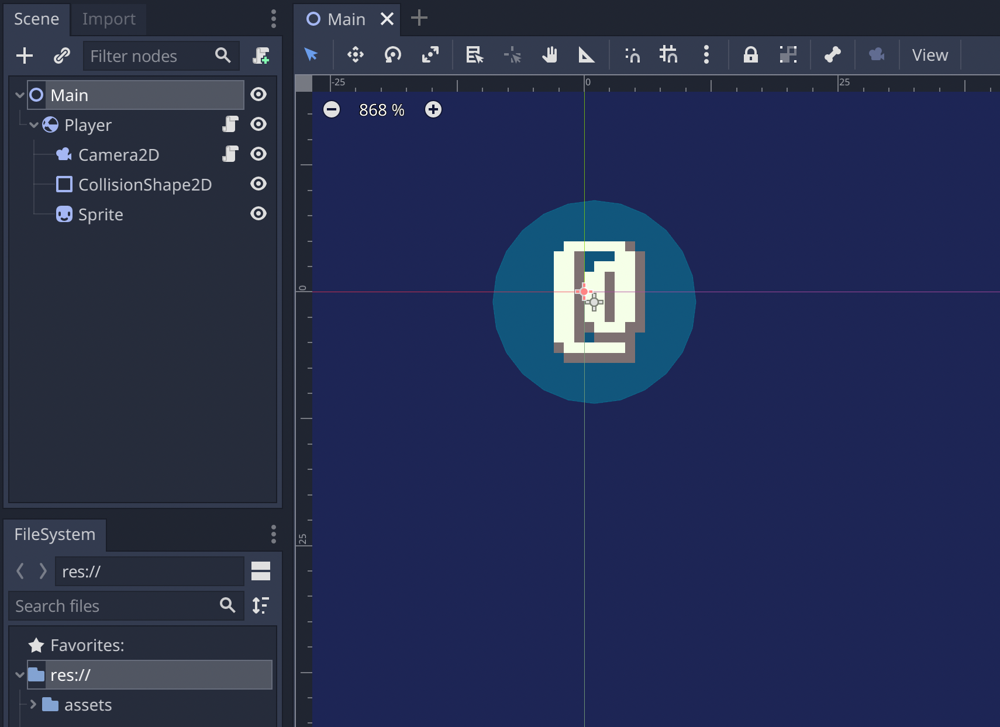

# Godot Chunking System 🌎

Checkout the blog post [here](https://dennissmuda.com/blog/godot-chunking-tutorial)!

> Uses a global `World.gd` Singleton to keep track of the player's position and load/unload chunks in seperate threads

## checkout and run 🚀

```bash
git clone https://github.com/DennisSmuda/godot-chunking-system.git
```

Open the `project.godot` and the main scene should open automatically:



run the project with `(cmd|ctrl)+R`

## Contribute 👋

Feel free to submit issues or pull requests
